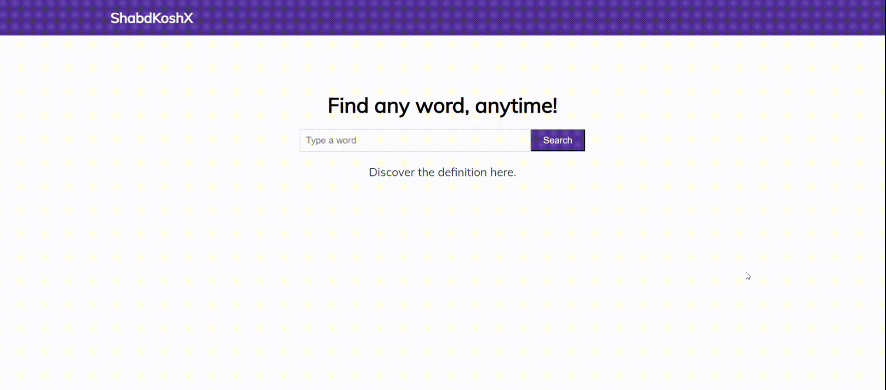

# Dictionary App

A simple dictionary application built with HTML, CSS, and JavaScript that lets you search for English words, view their definitions, and listen to pronunciation audio.

## Features

- **Word Search:** Enter any English word and click "Search" to fetch its definition.
- **Dynamic Data Fetching:** Retrieves definitions and audio from a free dictionary API.
- **Error Handling:** Displays a "No Result" message and suggestions if no valid data is found.
- **Audio Playback:** Play the word's pronunciation directly in the browser.
- **Responsive Design:** A clean, centered layout that works on both desktop and mobile devices.

## Usage

1. **Clone and Open:**  
   Clone the repository and open `index.html` in your browser.
2. **Search:**  
   Type an English word in the input field and press "Search."
3. **Results:**  
   View the definition, any suggestions, and play the audio (if available).

